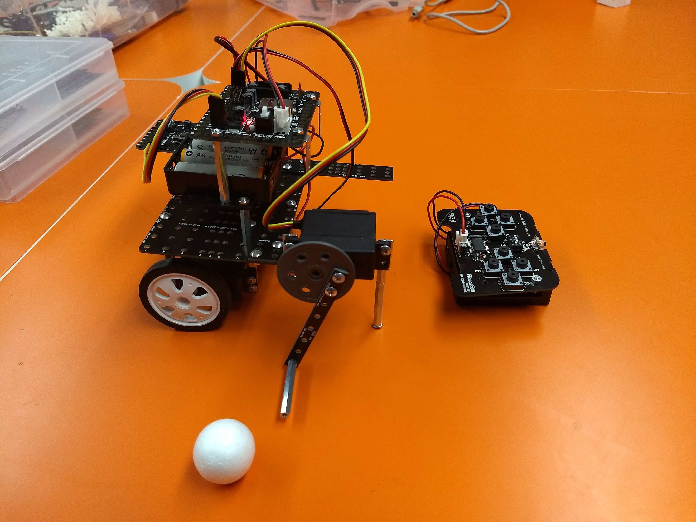
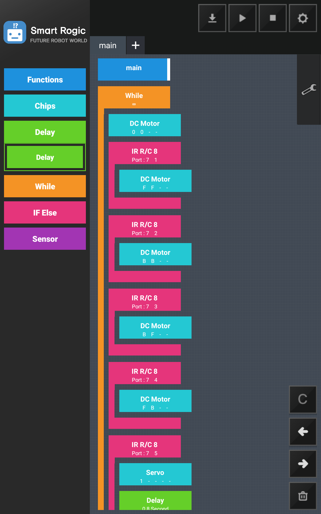
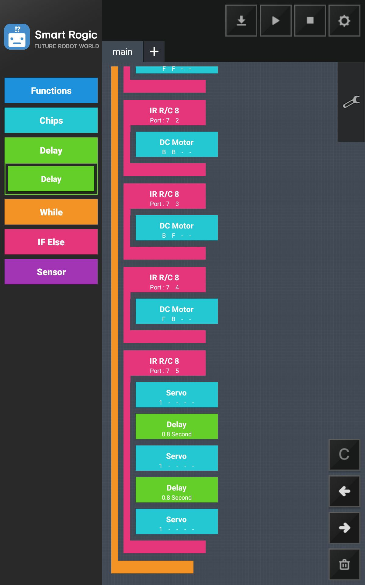

# Hockey Bot

This project uses the servo motor to implement the hockey stick motion (have the arching motion between 0 and 214 degrees), in addition to the DC motors used to control the robot back/forth, left/right.

Movements involved

* Move left
* Move right
* Move forward
* Move backward
* Hockey slapping motion

## Rogic Program Snapshot

## Demo Videos

* [Demo Video 1](https://photos.google.com/share/AF1QipPDHW5o9clfQ8jTtcyIB-tMuZUl6J6jKSI8XjMBMHgzZQJEp6AyYXJfk2DO3j6_pQ/photo/AF1QipOmrfZA23nj7WK9IHMn-A0PFC-FDpIqzZgegHvb?key=a1RuZW5hTnN5ZW5FRl9YSUhwRGpENVpQZ21TN2pR)
* [Demo Video 2](https://photos.google.com/share/AF1QipMu50mqDocDZAUJXhzDlp7Pm_Ltq8MGX1thKf1ez7UHkZeMSAQ1du0i8QX1QgysVw/photo/AF1QipNiK1MmPtjvfn6vRYwJMk-_yfnmldhJtYjA6EWn?key=VXY2V0NLTUxmQ09oM0sySEVGNHFzZk00eHBBVE5R)
